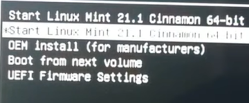

# Lab 01 - INFORME INSTALACION SO LINUX

Instalacion del sistema operativo open source linux 
* _**JUAN PABLO LOPEZ MARTINEZ**_

## Informe del laboratorio 

## 1. Marco teorico

* Linux: Linux es uno de los tantos flavors de Unix. Se trata de un sistema operativo de 32 bits de libre distribución, desarrollado originalmente por Linus Torvalds, un estudiante de la universidad finlandesa de Helsinki, quien, en 1991, se abocó a la tarea de reemplazar a Minix, un clon de Unix de pequeñas proporciones y finalidad académica desarrollado años antes por Andrew Tannenbaun [1]. 

## 2. Desarrollo e instalacion
   
El proceso de instalacion del sistema operativo de linux empezo escogiendo el "sabor" de linux a instalar. Por recomendacion del profesor y al ser la primera vez instalando un SO, se decidio por linux mint y la version Cinnamon. 
   

La version previamente dicha al terminarse de descargar, se intalara mediante una usb que debe ser de minimo 4 Gb. Este proceso se lleva a cabo gracias al uso de un software llamado Rufus. Este nos permite crear unidades de USB arrancables facilmente.

Ya descargado Rufus, se conecta la usb y procedemos a configurar la ventana con las opciones definidas en Rufus, como se muestra en la siguiente imagen (donde la eleccion de arranque del sistema debe ser la version de linux instalada previamente). Es importante recalcar, que todo lo que haya en la usb se borarra al continuar con el formateo de esta para el proceso, por lo que se debe hacer una copia si los documentos contenidos en la usb son de importancia o hacer uso de una usb totalmente nueva.

Ahora, procedemos a retirar la usb y a realizar la particion del disco para la instalacion de linux y poder tener los SO linux y windows al tiempo. Esto lo logramos en administrar mi equipo y se nos desplegara una ventana en donde iremos al apartado de administracion de discos (en almacenamiento). 

Aqui escogeremos que disco queremos reducir y posteriormente partir. Escogeremos el disco C y oprimiremos click derecho y reducir volumen, para que windows nos evalue la posibilidad en el disco escogido.

Posteriormente, se nos desplegara una ventana en donde debemos escoger ya el tamaño a reducir del disco en MB. Se escogio arbitrariamente un espacio de 60 Gb (esto ya depende de cada usuario pero se recomienda minimo 30 Gb), por lo que al deber poner el espacio en MB hacemos la conversion 1024 * 60 = 61440 MB 

Oprimimos en reducir, conectamos la usb y procedemos a reiniciar de forma avanzada el equipo. Esto para poder obtener las opciones que se nos brindara en este menu especial.

Ya en el menu, escogemos la usb y ejecutamos el sabor de linux mint escogido (primera opcion).

Ya adentro de linux mint, realizamos la configuracion inicial y cuando se termine de instalar procedemos a reiniciarlo (esta opcion nos la muestra automaticamente despues de terminar la configuracion inicial). Ahora, removemos la usb y presionamos enter

Donde ya se reiniciara solo el sistema y ya quedara instalado. Podemos ver que, ya cada vez que se prenda el computador se escoge el SO, ya sea windows o linux. 

Ya observando la particion del disco final con el linux instalado quedaria asi, segun nuestras respectivas condiciones:

Y el linux listo para usar.

## 3. Problemas relacionados con el proceso

Algunos problemas relacionados a la instalacion de linux fueron:

* Problemas al hacer la configuracion inicial del linux por el cifrado de documentos en windows 11 llamado Bitlocker (Se tuvo que desabilitar la opcion y reiniciar el dispositivo).
* Problemas con la configuracion preestablecida del windows.
* Problemas al iniciar por primeras veces el linux.

## 4. Ventajas del SO linux

* Linux es robusto, estable y rápido: Ideal para servidores y aplicaciones distribuidas.
* Linux es open source, esto implica no sólo la gratuidad del software, sino también que es modificable. Tiene una gran cantidad de aplicaciones libres en Internet. 
* Las vulnerabilidades son detectadas y corregidas más rápidamente que en cualquier otro SO.
  
## 5. Conclusiones

Linux es una herramienta sumamente poderosa que nos permite trabajar y desarrollar todo tipo de actividades. Conlleva una filosofia propia, no solo para el desarrollo y que basta con descargarla para ver el gran potencial de su uso.

## 6. Bibliografia

* [1] Obtenido de https://www.investigacion.frc.utn.edu.ar/labsis/publicaciones/queeslinux/queeslinux.html

